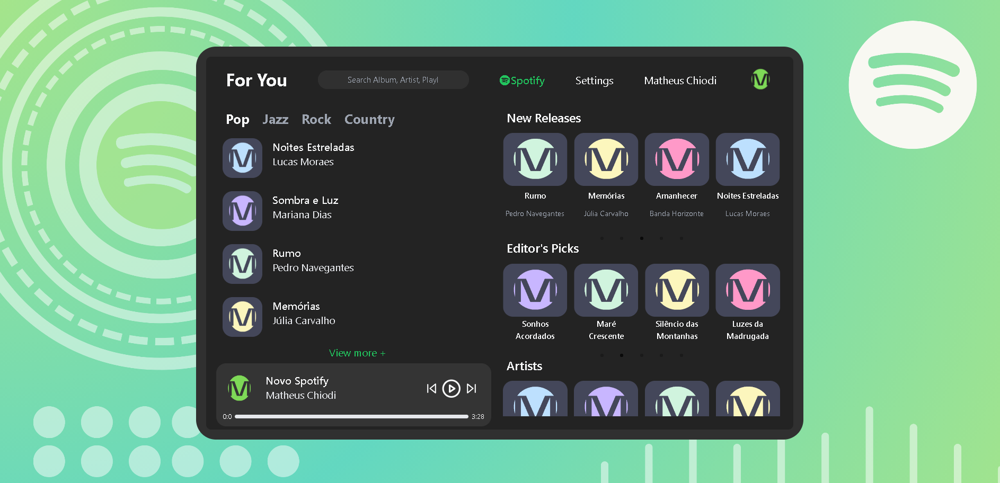

# 🎵 Spotify Reestruturado - ReactJS

---

Bem-vindo ao meu projeto **Spotify Reestruturado**! Este é um exercício de redesign e desenvolvimento em que recriei a interface do Spotify utilizando a poderosa biblioteca **ReactJS**.

---

## 🎯 Objetivo do Projeto

O principal objetivo deste projeto foi entender e replicar a experiência do usuário oferecida pelo Spotify, ao mesmo tempo em que aproveito para explorar e aprimorar minhas habilidades em ReactJS.

---

## 🌟 Destaques do Projeto

- **Design Moderno**: Um olhar fresco sobre a interface tradicional do Spotify.
- **Responsividade**: Projetado para funcionar perfeitamente em todos os dispositivos.
- **Componentização**: Uso eficaz dos componentes React para criar uma arquitetura limpa e reutilizável.

---

## 🔧 Tecnologias Utilizadas

- **ReactJS**: Para a construção de uma interface de usuário dinâmica e interativa.
